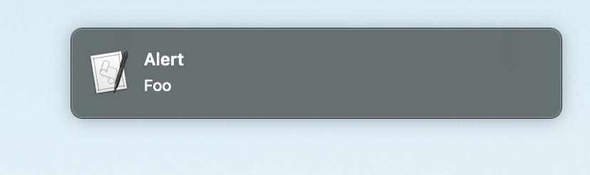

# sqs-alerts

sqs-alerts is a service for macOS that monitors an [AWS Simple Queue Services](https://aws.amazon.com/sqs) (SQS) queue
and pops up an alert for each message received.



Good for building simple monitoring systems. See e.g.
[examples/check_jobs.py](examples/check_jobs.py).

## Installation

* Set up an SQS queue.
* Install Boto (`pip install boto3`) and [configure AWS credentials](https://boto3.amazonaws.com/v1/documentation/api/latest/guide/configuration.html).
* Edit `QUEUE_NAME` in `alerts_from_sqs.py`, then install the script
 somewhere permanent on your filesystem (e.g. `~/.local/bin`).
* Edit `INSTALLPATH` in `alerts_from_sqs.plist` to specify where you installed it.
Then set the script to load on boot with 
`launchctl load .local/bin/alerts_from_sqs.plist`.

Test by sending a message manually with something like:

```
$ curl -d "Action=SendMessage&MessageBody=Foo&MessageGroupId=m0&MessageDeduplicationId=100" QUEUE_URL
```